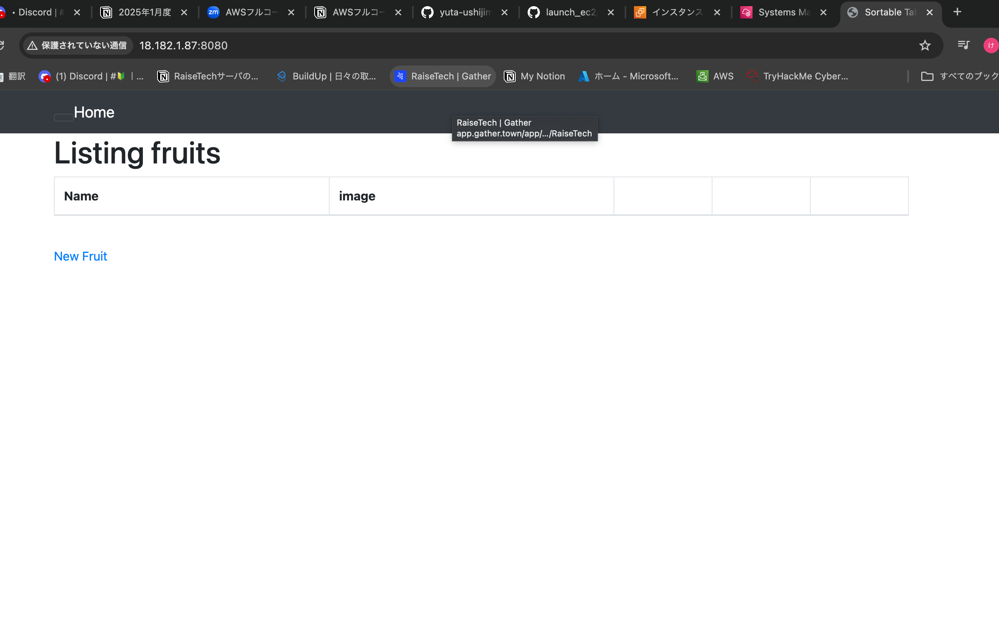
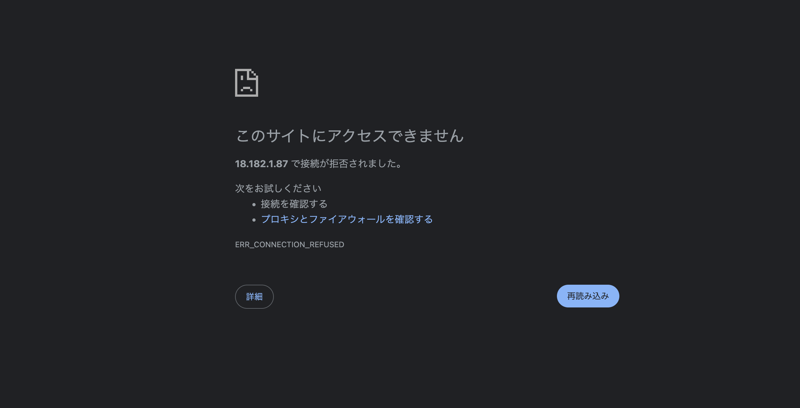
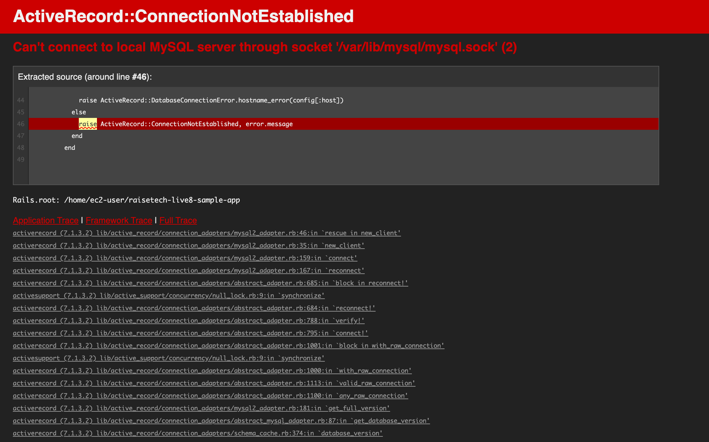

**今回の課題から学んだこと、感じたこと**
***
普段、普通に見ているWEBサイトは、APサーバーとDBサーバーが起動していないとアクセスできないこと。  
クラウドインフラは、こういうところの業務の一部分を担っていて、非常に分かりにくい設定もしていくのだと感じました。  
DBとAPを接続するために、設定ファイルにパスワードを共有したり、適切なディレクトリにソケットファイルを設定するのがややこしかったです。  
***
**アプリケーションサーバーについて**
***
*APサーバーの名前***puma***  
*バージョン　Puma version: ***6.4.2***  
*APサーバーとDBサーバー両方を起動させた場合、以下のようにデプロイ成功。  
  
*APサーバーを停止すると以下のようにエラーが表示される。  
  
*起動すれば、デプロイ成功時と同じブラウザ画面で立ち上がり元通りになる。  
***
**データベースサーバーについて**
***
*DBサーバーの名前　***MySQL***  
*バージョン Server version: ***8.4.5***  
*DBサーバーを停止させた場合、引き続きアクセスできず、以下のようなエラーがブラウザ上に出現します。  
  
***
**Ruby on Rails について**
***
*Rails の構成管理ツール ***Bundler***  

