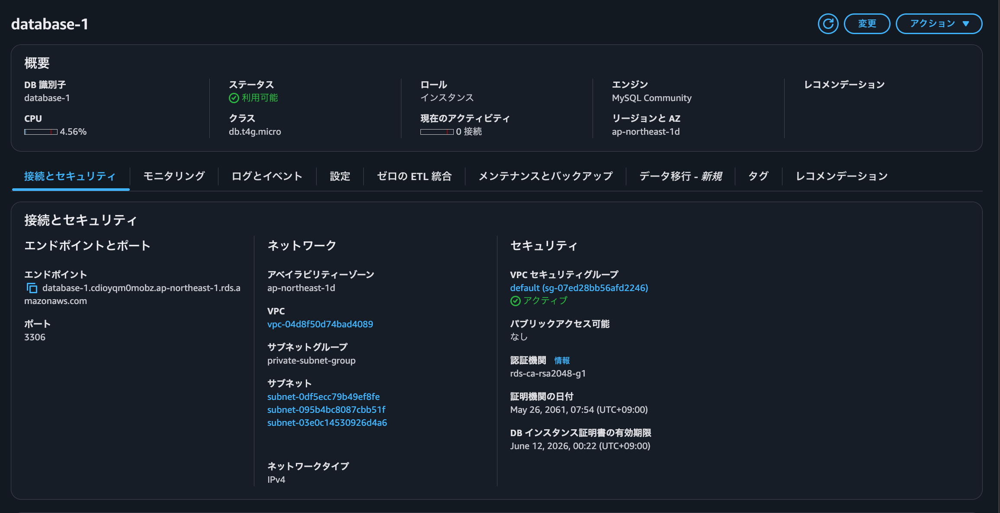
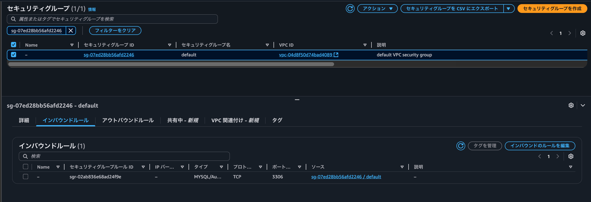

***第４回課題提出***
***
* EC2 インスタンスとRDS を正常に接続した画像が以下になります  
    
***  
* VPC 設定値のエビデンス画像が以下になります  

***
* RDS 設定値のエビデンス画像が以下になります  

***  
* EC2 設定値のエビデンス画像が以下になります  

***  
* RDS のセキュリティグループの画像が以下になります  

***
* EC2 のセキュリティグループの画像が以下になります  
  
