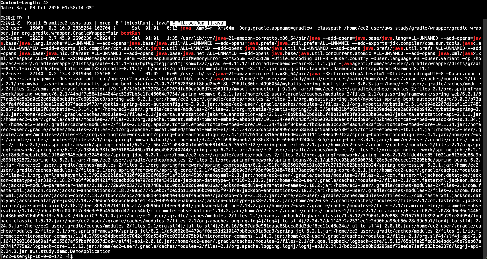
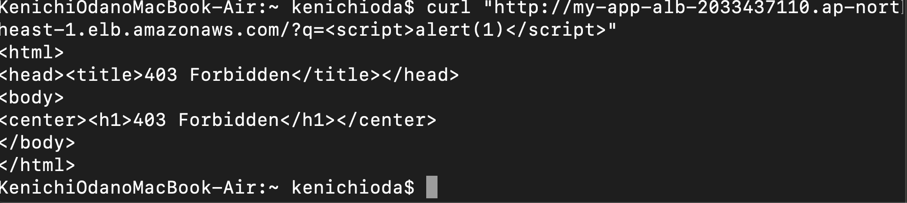
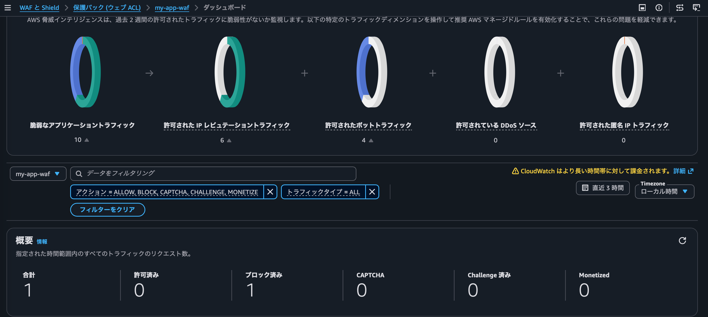
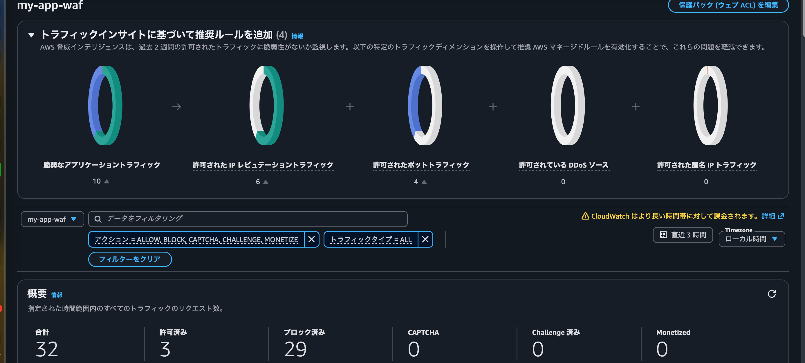
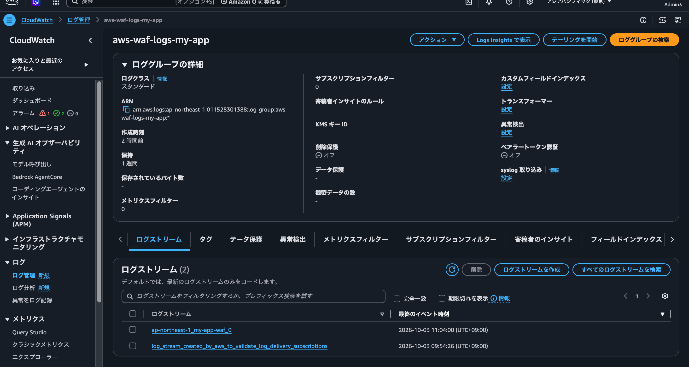

# [中級編１８回目の課題] WAFと CloudWatch logsの実装。

***
**実装内容**
***
  *VPC + EC2(単一インスタンス, パブリックサブネット配置) + RDS(MySQL, シングルAZ・単一インスタンス) + ALBにWAFを紐付けて、CloudWatch logsにWAFのルールでブロックされたリクエスト件数を出力し、AmazonSNS を介して、メール通知するように設定。
　*アプリケーションログにERRORが出た場合や、EC2インスタンスの CPU 使用率が 1 %を超えた場合も同じく通知されるように設定。
  *EC2への接続は AWS Systems Manager Session Manager経由。
  *EC2のUserDataでJava 21・Git・MySQLクライアントの自動インストール、アプリ(AppRepoUrl)のgit clone、
  application.propertiesのDB接続情報の自動置換、create.sqlによるテーブル自動作成。
  *WAFをALBに紐付けて、CloudWatch logsにログを出力。
  IAMロールを作成。SSM経由でEC2に接続するための権限(AmazonSSMManagedInstanceCore)と、CloudWatchログ・メトリクス送信に必要な権限(CloudWatchAgentServerPolicy)を付与。

***
**設計意図**
***
  *学習目的のため最小構成であり、コストを抑えることを重視。
  *セキュリティ観点と効率化の両立のため、EC2への接続はSSHではなくAWS Systems Manager Session Manager経由。
  *アプリ起動時の設定を効率化するため、アプリ起動までをUserDataで自動化。
  *個人情報保護の観点からGithub上にメールアドレスを公開しないため、SNS通知の送信先メールアドレスをパラメータ化。
  *学習目的のため、RDS の自動バックアップとスナップショットが自動生成されないように設定。

***
**動作確認**
***
### 1.  アプリケーション自動起動を確認。

### 2. ブロックされるリクエストを送った画面。

### 3. WAF のルールでブロックされる前のリクエスト件数。

### 4. WAF のルールでブロックされた後のリクエスト数。

### 5. CloudWatch logs にWAF でブロックされたリクエストが出力されている画面。

### 6. CloudWatch logs にWAF のロググループ作成済み画像。

***
**工夫した点、学んだこと**
***
  *WAF でブロックされたログを CloudWatchLogs に出力する実装で、WAFの設定でロググループを未作成が原因で躓きましたが、Qitaで技術者のブログを確認したり、Claudeとの壁打ちを利用して、関連付けの方法を模索しながら解決しました。
  *WAF やCloudWatch のスタックのコードの意味について理解が深まりました。